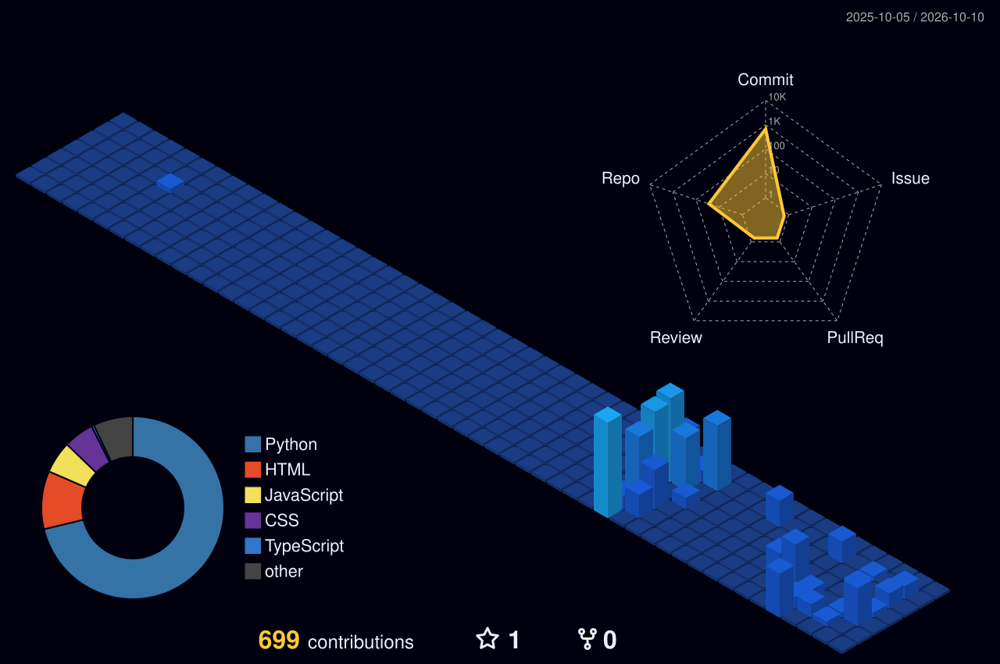

<!-- 🎬 HERO — avatar + name -->

  

<!-- 💻 LEFT: full-stack   •   🤖 RIGHT: automation -->

  

<!-- ⚛️ TECH STACK -->

  

<!-- 🪪 DEVELOPER ID + DASHBOARD -->

  

## 🚀 What I do

| Focus | What it is | Stack | Impact |
|:---|:---|:---|:---:|
| **Python Automation** | Automation solutions that remove repetitive manual work | `Python` `Selenium` `ETL` | ⏱️ 20+ hrs/week saved |
| **Web Scraping & Data Pipelines** | End-to-end collection, cleaning and structuring of data for BI & analytics | `Python` `BeautifulSoup` `Selenium` | 📊 BI-ready data |
| **KPI Dashboards** | Interactive dashboards consolidating multiple data sources | `Python` `REST APIs` | 💡 Faster insights |
| **Production Web Apps** | 5+ responsive apps with reusable component architecture | `React.js` `JavaScript` `HTML5` `CSS3` | 🌐 98% cross-browser |
| **API-Driven Front Ends** | RESTful integrations delivering real-time data and workflows | `React.js` `Node.js` `MongoDB` | 📈 +40% engagement |
| **Scalable Cloud Platforms** | Full-stack apps deployed with CI/CD and Agile practices | `AWS` `CI/CD` `Git` | 👥 10,000+ concurrent users |

 

### 🛠️ Featured Projects

| Project | Tech Stack | Highlights | Links |
| :--- | :--- | :--- | :---: |
| **3D Portfolio** | `TypeScript` `Modern CSS` | High-performance interactive 3D animations & component architecture | [Repository ↗](https://github.com/frankpatel1/3d-Portfolio) |
| **MovieScout** | `JavaScript` `REST APIs` `CSS3` | Dynamic movie search, API integration, and cinematic UI | [Repository ↗](https://github.com/frankpatel1/MovieScout) |
| **Shoe E-Commerce** | `JavaScript` `HTML5` `CSS3` | Fully responsive store featuring cart logic and catalog navigation | [Repository ↗](https://github.com/frankpatel1/shoe-ecommerce) |
| **In-Browser Image Resizer** | `JavaScript` `Canvas API` | Client-side file processing, instant resizing, and zero-server latency | [Repository ↗](https://github.com/frankpatel1/Image-Resizer-JavaScript) |

 

## 📊 GitHub at a glance

 

## 🌃 My contribution city

*Every commit builds another tower — rebuilt automatically every day.*

  

<!-- 💌 LET'S CONNECT -->

&nbsp;

&nbsp;

  

  

**Automate the boring stuff, ship the rest.** 💜

